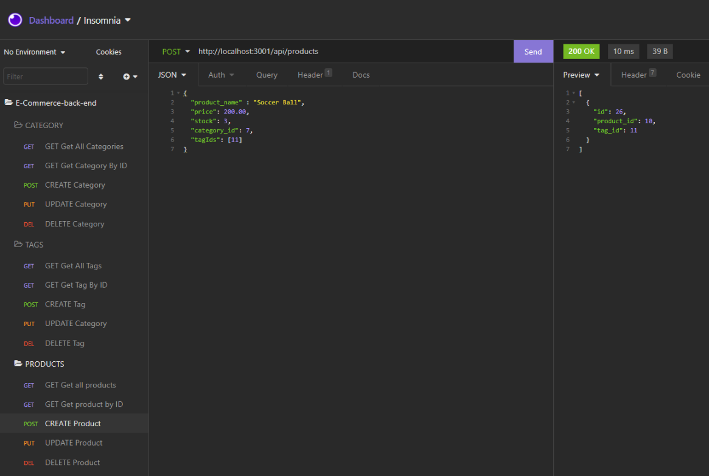

# Object-Relational Mapping (ORM): E-Commerce Back End

[](https://opensource.org/licenses/MIT)


[](https://www.npmjs.com/package/mysql2)
[](https://www.npmjs.com/package/sequelize)
[](https://www.npmjs.com/package/express)
[](https://www.npmjs.com/package/dotenv)

<details>
<summary><h2>Table of Contents</h2></summary>

- [Description](#description)
- [Installation](#installation)
- [Usage](#usage)
- [License](#license)
- [Contributing](#contributing)
- [Follow](#follow)
</details>

----

## Description

For this project I had to build the back end for an e-commerce site by modifying starter code. I configured a working [Express.js](https://www.npmjs.com/package/express) API to use [Sequelize](https://www.npmjs.com/package/sequelize) to interact with a [MySQL](https://dev.mysql.com/downloads/mysql/) database.

The following animation shows the application's API Routes being tested in Insomnia Core to perform RESTful CRUD operations:


----

## Installation

💾    

- This application need node.js, please refer to [Offical website](https://nodejs.org/en/download/) for installation.
- This application also need to install mysql, please refer to [mysql](https://coding-boot-camp.github.io/full-stack/mysql/mysql-installation-guide/) for installation
- Add your mysql password to the  ```.env``` file
- Install required node packages by running the following at the root of your project

    ```bash
    npm install
    ```

- Create database by running  ```SOURCE db/schema.sql``` at the root of your project
- Add sample data to the database by running  ```node seeds/index``` at the root of your project

----

## Usage

💻   
  
Run the following command at the root of your project.

`node server` or `npm start`

🎥  A video of the typical user flow through the application can be found here [E-Commerce Back End]() 

Also refer to the following screenshots

  

 

----

## License

This App is covered by the \


----

## Contributing

Fork this repository if you want to contribute\
[](https://github.com/MM-SalvoDragotta/E-Commerce-back-end/fork)

----

## Follow
[](https://twitter.com/Dynamo_Sydney)\
[](https://github.com/MM-SalvoDragotta/)